# Documentação de Dados: Sistema Cotag

## 1. Visão Geral

Este documento detalha o modelo de dados do sistema **Cotag**, uma aplicação projetada para o **controle de cotas de cópias da gráfica** de uma instituição de ensino. A aplicação gerencia o saldo de impressões dos usuários, registra cada transação e permite a administração de diferentes níveis de acesso e cotas com base no vínculo do usuário com a instituição.

## 2. Diagrama Entidade-Relacionamento (DER)

O diagrama abaixo representa a estrutura do banco de dados, mostrando as tabelas (entidades), suas colunas (atributos) e como elas se conectam através de chaves primárias e estrangeiras.

## 3. Dicionário de Dados

A seguir, a descrição detalhada de cada tabela do banco de dados, seu propósito e a especificação de suas colunas.

### Tabela: `PESSOA`
* **Propósito:** Armazena o registro de cada indivíduo que utiliza os serviços da gráfica. É a entidade central para o controle de cotas.

| Nome da Coluna | Chave | Tipo de Dado (Inferido) | Descrição |
| :--- | :--- | :--- | :--- |
| `codpes` | **PK** | Inteiro | **(Chave Primária)** Identificador único da pessoa, correspondente ao Número USP. |
| `nompes` | | Texto | Nome completo da pessoa. |

### Tabela: `VINCULO`
* **Propósito:** Associa uma pessoa a um ou mais tipos de relacionamento com a instituição. Este vínculo é a base para a definição da cota de impressão padrão.

| Nome da Coluna | Chave | Tipo de Dado (Inferido) | Descrição |
| :--- | :--- | :--- | :--- |
| `codpes` | | Inteiro | Identifica a pessoa (associado à tabela `PESSOA`). |
| `vinculo` | | Texto | Descreve a relação (ex: `DOCENTE`, `ALUNOPOS`, `SERVIDOR`). |

### Tabela: `COTA`
* **Propósito:** Tabela de regras que define a quantidade padrão de cópias mensais para cada tipo de `vinculo`.

| Nome da Coluna | Chave | Tipo de Dado (Inferido) | Descrição |
| :--- | :--- | :--- | :--- |
| `id` | **PK** | Inteiro | **(Chave Primária)** Identificador único da regra de cota. |
| `vinculo` | | Texto | O tipo de vínculo ao qual a cota se aplica. |
| `valor` | | Inteiro | A quantidade de cópias padrão para o vínculo. |

### Tabela: `COTA_ESPECIAL`
* **Propósito:** Permite atribuir uma cota extraordinária para uma pessoa específica, sobrepondo a cota padrão de seu vínculo.

| Nome da Coluna | Chave | Tipo de Dado (Inferido) | Descrição |
| :--- | :--- | :--- | :--- |
| `id` | **PK** | Inteiro | **(Chave Primária)** Identificador único da cota especial. |
| `codpes` | **FK** -> `PESSOA(codpes)` | Inteiro | Identifica a pessoa que recebe a cota especial. |
| `valor` | | Inteiro | O valor da cota especial atribuída. |

### Tabela: `LANCAMENTO`
* **Propósito:** Funciona como o "livro-razão" do sistema, registrando cada uso (débito) ou adição (crédito) de cópias no saldo de um usuário.

| Nome da Coluna | Chave | Tipo de Dado (Inferido) | Descrição |
| :--- | :--- | :--- | :--- |
| `id` | **PK** | Inteiro | **(Chave Primária)** Identificador único do lançamento. |
| `data` | | Data/Hora | Data e hora em que a transação foi registrada. |
| `tipoLancamento` | | Inteiro (Enum) | Tipo de operação (provavelmente `0` para crédito e `1` para débito). |
| `valor` | | Inteiro | Quantidade de cópias da transação. |
| `pessoa_codpes`| **FK** -> `PESSOA(codpes)` | Inteiro | Identifica a pessoa a quem o lançamento pertence. |
| `usuario_id` | **FK** -> `USUARIO(id)` | Inteiro | Identifica o operador do sistema que registrou o lançamento. |

### Tabela: `PESSOA_LANCAMENTO`
* **Propósito:** Esta tabela aparenta ser uma tabela de junção (join table) **antiga ou não utilizada**, possivelmente de uma versão anterior do modelo de dados. Sua estrutura sugere uma relação entre `PESSOA` e `LANCAMENTO`. No entanto, no modelo atual, a tabela `LANCAMENTO` já possui uma chave estrangeira (`pessoa_codpes`) que a associa diretamente à `PESSOA`, tornando a `PESSOA_LANCAMENTO` redundante. A tabela está vazia nos dumps de dados, reforçando a ideia de que ela não está em uso ativo.

| Nome da Coluna | Chave | Tipo de Dado (Inferido) | Descrição |
| :--- | :--- | :--- | :--- |
| `Pessoa_id` | Provavelmente FK | Inteiro | Provavelmente uma referência ao ID da pessoa (potencialmente redundante). |
| `lancamentos_id` | Chave Única | Inteiro | Referência ao ID de um lançamento (`LANCAMENTO`). |
| `Pessoa_codpes`| Provavelmente FK | Inteiro | Referência redundante ao `codpes` da pessoa, já presente na tabela `LANCAMENTO`. |

### Tabela: `USUARIO`
* **Propósito:** Gerencia os operadores do sistema (funcionários, administradores), que possuem login para acessar a aplicação e gerenciar os lançamentos.

| Nome da Coluna | Chave | Tipo de Dado (Inferido) | Descrição |
| :--- | :--- | :--- | :--- |
| `id` | **PK** | Inteiro | **(Chave Primária)** Identificador único do usuário operador. |
| `codpes` | | Inteiro | Número USP do operador. |
| `nompes` | | Texto | Nome do operador. |
| `email` | | Texto | E-mail para contato e recuperação de senha. |
| `senha` | | Texto | Hash da senha para login local. |
| `salt` | | Texto | Valor aleatório usado para aumentar a segurança do hash da senha. |

### Tabela: `PAPEL`
* **Propósito:** Define os níveis de permissão (roles) dentro do sistema, como `ADM` (Administrador) e `OPR` (Operador).

| Nome da Coluna | Chave | Tipo de Dado (Inferido) | Descrição |
| :--- | :--- | :--- | :--- |
| `id` | **PK** | Inteiro | **(Chave Primária)** Identificador único do papel. |
| `nome` | | Texto | Nome do papel (ex: `ADM`). |

### Tabela: `USUARIO_PAPEL`
* **Propósito:** Tabela de junção que associa usuários aos seus respectivos papéis, definindo suas permissões no sistema (relação Muitos-para-Muitos).

| Nome da Coluna | Chave | Tipo de Dado (Inferido) | Descrição |
| :--- | :--- | :--- | :--- |
| `usuario_id` | **FK** -> `USUARIO(id)` | Inteiro | Identifica o usuário. |
| `papel_id` | **FK** -> `PAPEL(id)` | Inteiro | Identifica o papel atribuído. |

### Tabela: `MENSAGEM`
* **Propósito:** Esta tabela parece ter sido projetada para funcionar como uma fila ou um log de e-mails a serem enviados pelo sistema. Ela armazena o conteúdo completo de uma mensagem, incluindo remetente, destinatário, assunto e corpo, além de controlar quando foi criada e quando foi enviada.

| Nome da Coluna | Chave | Tipo de Dado (Inferido) | Descrição |
| :--- | :--- | :--- | :--- |
| `id` | **PK** | Inteiro | **(Chave Primária)** Identificador único da mensagem. |
| `assunto` | | Texto | O assunto do e-mail. |
| `criacao` | | Data/Hora | Data e hora em que o registro da mensagem foi criado no sistema. |
| `de` | | Texto | O endereço de e-mail do remetente. |
| `envio` | | Data/Hora | Data e hora em que o e-mail foi efetivamente enviado. |
| `mensagem` | | Texto Longo | O corpo/conteúdo do e-mail. |
| `para` | | Texto | O endereço de e-mail do destinatário. |

### Tabela: `OU`
* **Propósito:** Sigla para **Unidade Organizacional**. Armazena o cadastro de seções ou departamentos da instituição para organizar grupos de usuários.

| Nome da Coluna | Chave | Tipo de Dado (Inferido) | Descrição |
| :--- | :--- | :--- | :--- |
| `id` | **PK** | Inteiro | **(Chave Primária)** Identificador da unidade. |
| `nome` | | Texto | Nome da unidade (ex: "Serviço de Artes Gráficas"). |
| `sigla` | | Texto | Sigla da unidade (ex: "SVARGRA-45"). |

### Tabela: `GRUPO`
* **Propósito:** Define grupos de usuários, geralmente associados a uma Unidade Organizacional.

| Nome da Coluna | Chave | Tipo de Dado (Inferido) | Descrição |
| :--- | :--- | :--- | :--- |
| `id` | **PK** | Inteiro | **(Chave Primária)** Identificador do grupo. |
| `nome` | | Texto | Nome do grupo (ex: `OPR`). |
| `ou_id` | **FK** -> `OU(id)` | Inteiro | Associa o grupo a uma unidade organizacional. |

### Tabela: `USUARIO_GRUPO`
* **Propósito:** Tabela de junção que associa usuários a um ou mais grupos (relação Muitos-para-Muitos).

| Nome da Coluna | Chave | Tipo de Dado (Inferido) | Descrição |
| :--- | :--- | :--- | :--- |
| `usuario_id` | **FK** -> `USUARIO(id)` | Inteiro | Identifica o usuário. |
| `grupo_id` | **FK** -> `GRUPO(id)` | Inteiro | Identifica o grupo. |

### Tabela: `LOG`
* **Propósito:** Registra eventos importantes do sistema para fins de auditoria, como logins, erros e operações críticas.

| Nome da Coluna | Chave | Tipo de Dado (Inferido) | Descrição |
| :--- | :--- | :--- | :--- |
| `id` | **PK** | Inteiro | **(Chave Primária)** Identificador único do log. |
| `timestamp` | | Data/Hora | Data e hora em que o evento ocorreu. |
| `operacao` | | Texto | Descrição da ação realizada (ex: `AUTENTICACAO USP`). |
| `status` | | Texto | Resultado da operação (`OK`, `NEGADO`). |
| `usuario` | **FK** -> `USUARIO(id)` | Inteiro | Operador que executou a ação (pode ser nulo). |
| `descricao` | | Texto | Detalhes adicionais, como o endereço IP. |

### Tabela: `REQUISICAO_SENHA`
* **Propósito:** Gerencia o processo de recuperação de senha para o login local, armazenando um token temporário e sua validade.

| Nome da Coluna | Chave | Tipo de Dado (Inferido) | Descrição |
| :--- | :--- | :--- | :--- |
| `id` | **PK** | Inteiro | **(Chave Primária)** Identificador da requisição. |
| `token` | | Texto | Código único enviado ao usuário para redefinição da senha. |
| `usuario_id`| | Inteiro | O usuário que solicitou a recuperação. |
| `validade` | | Data/Hora | Data e hora em que o token expira. |
| `ativa` | | Booleano | Flag que indica se a requisição ainda é válida. |

### Tabela: `TOKEN`
* **Propósito:** Armazena tokens de autenticação persistentes, possivelmente para funcionalidades como "Lembrar de mim" ou para acesso via API.

| Nome da Coluna | Chave | Tipo de Dado (Inferido) | Descrição |
| :--- | :--- | :--- | :--- |
| `id` | **PK** | Inteiro | **(Chave Primária)** Identificador do token. |
| `token` | | Texto | A string única do token. |
| `usuario_id` | **FK** -> `USUARIO(id)` | Inteiro | Associa o token a um operador do sistema. |
| `validade` | | Data/Hora | Data de expiração do token. |

### Tabela: `hibernate_sequence`
* **Propósito:** Tabela utilitária interna do framework Hibernate. **Não possui relevância para a regra de negócio.** É usada para gerar as chaves primárias de forma sequencial.

| Nome da Coluna | Chave | Tipo de Dado (Inferido) | Descrição |
| :--- | :--- | :--- | :--- |
| `next_val` | | Inteiro | Armazena o próximo número disponível para ser usado como um novo ID. |