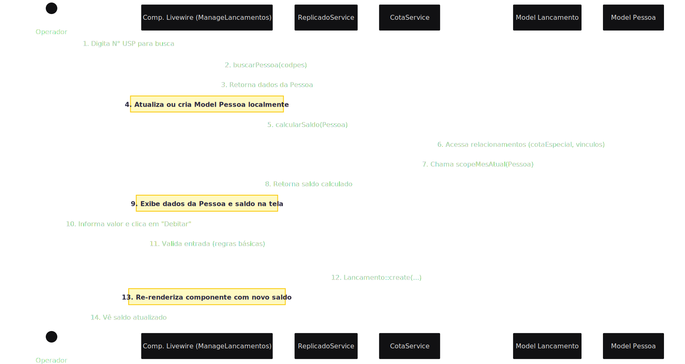

# Proposta de Arquitetura e Mapeamento de Lógica - Novo Sistema CotaG

## 1. Objetivo

Este documento delineia a arquitetura de software para a nova versão do sistema CotaG, a ser construída sobre o **Laravel 12 USP Starter Kit**. O foco é mapear as regras de negócio identificadas na fase de análise (documento `docs/analise/03-regras-de-negocio.md`) para componentes arquiteturais específicos do Laravel, garantindo uma estrutura moderna, manutenível e testável que siga as boas práticas do framework e do nosso projeto.

## 2. Princípios Arquiteturais

A arquitetura seguirá os princípios fundamentais do nosso Starter Kit para garantir a qualidade e a longevidade do código:

1.  **Controllers e Componentes Livewire Magros:** A camada de apresentação (Controllers e Componentes Livewire) será responsável exclusivamente por receber requisições HTTP, validar a entrada (através de Form Requests) e orquestrar as chamadas para a camada de serviço. Ela não conterá lógica de negócio.
2.  **Lógica de Negócio em Services:** Toda a lógica de negócio complexa e reutilizável, como o cálculo de saldo e a interação com sistemas externos, será encapsulada em classes de serviço (`Services`) dedicadas. Isso promove a reutilização, facilita os testes unitários e desacopla a lógica do framework.
3.  **Princípio da Responsabilidade Única (SRP):** Cada classe terá uma única e bem definida responsabilidade. Por exemplo, um serviço para interagir com o Replicado, outro para processar as regras de cota, e componentes Livewire para gerenciar a interface.
4.  **Interface Administrativa com Filament:** Todas as operações de CRUD (Create, Read, Update, Delete) para as entidades de negócio (Cotas, Usuários, Papéis) serão implementadas utilizando o **Filament**, garantindo uma interface administrativa robusta, segura e de rápido desenvolvimento.

## 3. Mapeamento da Lógica de Negócio para Componentes Arquiteturais

A tabela a seguir detalha onde cada regra de negócio do sistema CotaG será implementada na nova arquitetura Laravel, com a respectiva justificativa para a escolha de cada componente.

| Regra de Negócio | Componente Arquitetural Proposto | Justificativa |
| :--- | :--- | :--- |
| **Cálculo de Saldo e Cota Mensal** | `App\Services\CotaService` `App\Models\Pessoa::getSaldoAttribute()` | A lógica é complexa (envolve cotas especiais, vínculos e lançamentos do mês) e será reutilizada. Um **Accessor** no model `Pessoa` pode chamar o serviço para simplificar o acesso (`$pessoa->saldo`), mantendo a lógica centralizada no `CotaService`. |
| **Validação de Lançamento de Débito/Crédito** | `App\Http\Requests\StoreLancamentoRequest` | Encapsula todas as regras de validação para a criação de um lançamento (ex: `pessoa_id` existe, `valor` é um inteiro positivo). Garante que o Controller ou Componente Livewire receba apenas dados válidos, seguindo a prática de "Controllers Magros". |
| **Busca de Cliente no Replicado** | `App\Services\ReplicadoService` | Isola a comunicação com uma dependência externa (banco de dados Replicado), facilitando a manutenção, o cache e, crucialmente, a criação de mocks (`FakeReplicadoService`) para testes automatizados. |
| **Interface de Lançamento** | Componente `Livewire\Lancamento\ManageLancamentos` | A interface é altamente interativa (busca de usuário, exibição dinâmica de saldo, registro de transação com feedback imediato), o que é ideal para um componente **Livewire**, eliminando a necessidade de escrever JavaScript complexo. |
| **Gestão de Usuários, Papéis e Cotas** | **Filament Resources**: `UserResource`, `RoleResource`, `CotaResource`, `CotaEspecialResource` | São tarefas administrativas clássicas de CRUD, perfeitas para a estrutura de desenvolvimento rápido e seguro que o **Filament** oferece. Isso centraliza a administração do sistema em um painel robusto e padronizado, alinhando-se com o papel do perfil `ADM`. |
| **Renovação Mensal da Cota** | `App\Services\CotaService` e `App\Models\Lancamento` (Query Scope) | A "renovação" é uma consequência da consulta que busca lançamentos apenas do mês corrente. Essa lógica será implementada como um **Query Scope** no model `Lancamento` (ex: `scopeMesAtual()`) e utilizada pelo `CotaService` ao calcular o saldo. |

## 4. Estratégia de Implementação e Fluxo de Dados

A interação entre os componentes seguirá um fluxo claro e desacoplado. O diagrama abaixo ilustra a principal operação do sistema: **registrar um lançamento de débito**.

## 5. Conclusão

Esta arquitetura baseada em `Services` e `Controllers Magros` garante uma clara separação de responsabilidades, alinhando-se com as melhores práticas do Laravel. Migrar a lógica de negócio para componentes dedicados e utilizar ferramentas como Livewire para a interatividade e Filament para a administração tornará o novo sistema CotaG significativamente mais flexível, testável e fácil de manter a longo prazo.